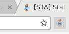
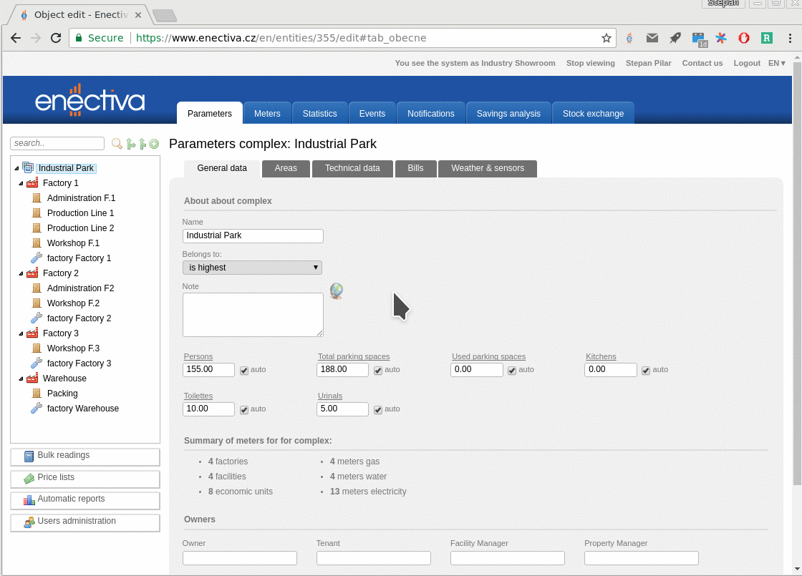

# Bug reporting

When reporting a bug providing more context makes it better (usually). Often, the first questions after a bug report are *what browser are you using?*, *what OS are you running?*, *what's the URL?* etc.

## Emperor Gum Moth

To simplify this, we have a browser extension which captures the things that can be easily done automatically. It's called Emperor Gum Moth and available for [Chrome](https://chrome.google.com/webstore/detail/emperor-gum-moth/hpcidlmnbnafmbflogffiogonnchckbe) and [FF](emperor_gum_moth.xpi).

## Use

After you install the extension, it will add a button with Enectiva logo to your browser. Whenever you find a bug in Enectiva, click on that button:

New tab with GitLab will be opened with information about your browser:

 
Now just add a title to the bug, describe it in more detail (above the pre-filled information), and assign it to a developer.

## Limitations

- You need to logged in to GitLab already
- It doesn't work for Meta or other modules